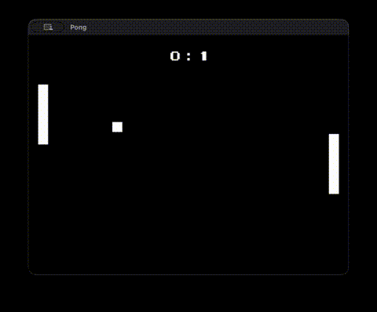

I published a web build of this project: https://alihanbays.itch.io/sdl3-pong-demo



# SDL3 Pong

A Pong clone built from scratch with C++ and SDL3.

### Dependencies
* SDL3
* SDL3_image
* SDL3_ttf
* SDL3_mixer

### Controls
* **Player 1**: Use **W** and **S** to move.
* **Player 2**: Use the **Up** and **Down** arrows to move.

### How to build

The project uses CMake.

```bash
cmake -B build
cmake --build build
./build/Pong
```

### License
Anyone can use or change this code for any purpose. You do not need to reach out to me for permission or provide attribution.
